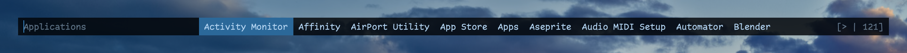

<h1 align="center">menu</h1>

<p align="center">
	<strong>Dynamic menu for the Mac.</strong><br>
	<i>Minimal, elegant, customisable.</i>
</p>

<p align="center">
	
</p>

<p align="center">
	<a href="https://github.com/paninihouse/menu/blob/master/LICENSE"></a>
	
	<a href="https://panini.house"></a>
	<a href="https://docs.panini.house/menu"></a>
</p>

All the launchers and pickers we tried felt wrong in one way or another, so we decided to make our own.
Here is what you should know about *menu* before you start:

- **Just different** — *menu* doesn't work like most other launchers or programs for what matters.
You configure it by directly changing the source code and tinkering with Swift files.
At the end, everyone will have their own *menu*.
- **Dead simple** — *menu* always looks for simplicity, both in usage and in the source code.
It just does the very basics very well; everything else is left out.
It doesn't even include a visible text field.
- **Easy to understand** — *menu*'s codebase is just ~700 lines of Swift, wrapped in a ton of comments.
Everything is explained so you can truly own the codebase and customise it as you see fit.

> This is not software you install, run, and forget about.
> You're supposed to understand how it works, customise it, and ultimately give back enhancements to the community.

`menu` was inspired by some great [suckless tools](https://suckless.org/) like [dmenu](https://tools.suckless.org/dmenu/).

---

## Features

### Simple usage

Pipe a list of newline-separated items into *menu* and pick one with the keyboard:

```sh
echo "Apple\nBanana\nMango\nPeach" | menu
```

The selected item is printed to `stdout`, ready to be composed with any other tool.

### Fuzzy matching

Type to narrow the list down to the items matching your input:

```sh
ls | menu | xargs open
```

### Two layouts

Present choices inline on a single row, or vertically with a fixed number of lines:

```sh
# Inline (default)
echo "Apple\nBanana\nMango\nPeach" | menu

# Vertical, up to 10 lines
echo "Apple\nBanana\nMango\nPeach" | menu --lines 10
```

### Key bindings

Every action is a key binding defined in source, so you can rebind anything to anything:

```swift
static let bindings: [Binding] = [
	.init(.return, action: .confirm),
	.init(.return, .control, action: .confirmInput),
	.init(.escape, action: .quit),
	.init(.tab, action: .complete),
	.init("j", .control, action: .forward),
	.init("k", .control, action: .backward),
]
```

### Options

| Option | Description | Default |
| --- | --- | --- |
| `-l`, `--lines <n>` | List choices vertically, with the given number of lines. | |
| `-t`, `--top` / `-b`, `--bottom` | Define the position of the menu on the screen. | `--top` |
| `-p`, `--prompt <prompt>` | Define the prompt to be displayed before the input. | |
| `-c`, `--counter` | Define the visibility of the counter. | |
| `-m`, `--monitor <n>` | Display on the monitor number supplied. | `0` |

---

## Get started & Full documentation

The full documentation, with a get started guide, is available at [https://docs.panini.house/menu](https://docs.panini.house/menu).
